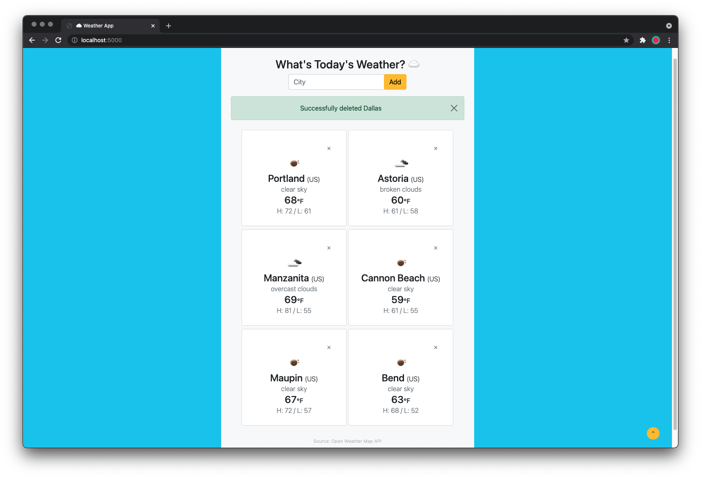
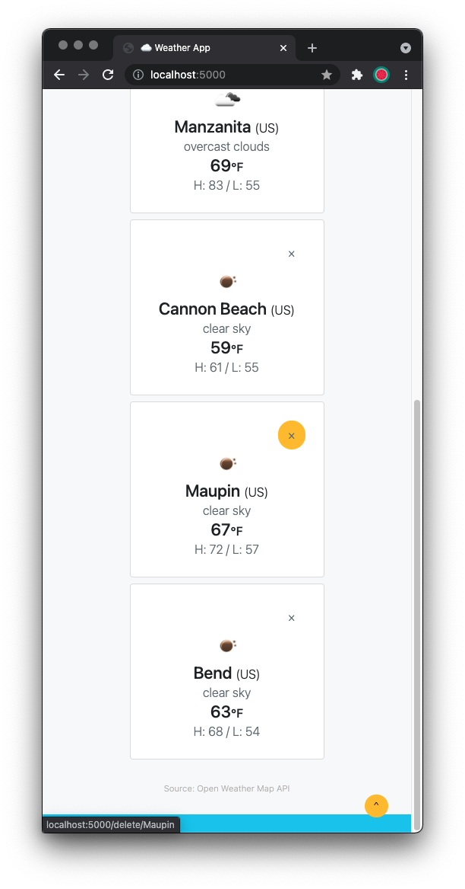

# **☁️ Weather App**

A simple weather application inspired from a YouTube tutorial [PrettyPrinted](https://www.youtube.com/watch?v=lWA0GgUN8kg). Data is pulled via the [Open Weather Map API](https://openweathermap.org/api) and allows for tracking of current weather in multiple cities worldwide.

## **Build**
- **Language & Framework:** Python, JavaScript, Flask
- **Database:** Flask-SQLAlchemy
- **Styling:** Bootstrap, LESS
- **Scripting:** Bash
- **Deployment:** Docker, Azure 

## **Features**
- Data pulled from Open Weather Map API 
- Add/delete city functionality
- Flask SQLAlchemy database used to store city inputs
- Alert flash messaging for entries via add/delete/invalid/duplicate
- Responsive styling viewable on mobile or desktop devices
- Return-to-top button for user-friendly interface
- Containerized via Docker with bash scripts ti automate build/run/stop commands
- Deployed via Azure container registry and Azure App Service w/ continuous deployment

## **Preview:**

## **Getting Started**

### **Clone repository**

    $ git clone https://github.com/cassjs/weather-app.git

* Navigate to the project folder

      $ cd weather-app
      
### **Docker**

* **Download Docker Desktop:** https://www.docker.com/get-started. There are versions available for Linux, Max, and Windows. **What is Docker?** Docker is a platform for building, running, and shipping applications. Docker packages up an application with everything it needs and allows an app to run and function the same way on any user's local machine.

* **Create a Docker ID:** https://hub.docker.com/signup

* **Login:** You will be prompted to enter your Docker credentials.
      
      $ docker login
      
* **Build Docker Image:** 
      
      $ ./scripts/build.sh
      
* **Run Application/Docker Container:**
      
      $ ./scripts/run.sh
      # Opens a browser http://localhost:5000

### **Editing Application**
* **Stop Running Container:** 

      $ ./scripts/stop.sh  
      
* **Multiple Edits:** For efficiency with multiple edits, it is recommened to create your own virtual enviorment within your local machine. Once all edits are confirmed, just rebuild and run the container with the commands from the Docker section. 

	

		
Click to expand! Create a local virtual enviornment

	* Create a new virtual environment

	      #conda
	      $ conda create -n myenv python=3.8

		or

	      #venv
	      $ python -m venv myenv

	### **Activate virtual environment**

	* Activate your new virtual environment

	      #conda
	      $ conda activate myenv

		or

	      #venv (Windows)
	      $ myenv/Scripts/activate    

		or

	      #venv (Mac / Unix / WSL)
	      $ source myenv/bin/activate

	### **Install requirements.txt**

	* Install the required packages

	      $ pip install -r requirements.txt

	### **FLASK_ENV Variable**

	* Set the flask environment

	      #Windows
	      $ set FLASK_ENV=fin_app.py

		or

	      #Mac / Unix / WSL
	      $ export FLASK_ENV=fin_app.py

	### **Run application**

	* Run the app using Flask

	      $ flask run

	

## **License**

[MIT License](https://opensource.org/licenses/MIT)\
Copyright (c) 2021 Jessica Cassidy

Permission is hereby granted, free of charge, to any person obtaining a copy of this software and associated documentation files (the "Software"), to deal in the Software without restriction, including without limitation the rights to use, copy, modify, merge, publish, distribute, sublicense, and/or sell copies of the Software, and to permit persons to whom the Software is furnished to do so, subject to the following conditions:

The above copyright notice and this permission notice shall be included in all copies or substantial portions of the Software.

THE SOFTWARE IS PROVIDED "AS IS", WITHOUT WARRANTY OF ANY KIND, EXPRESS OR IMPLIED, INCLUDING BUT NOT LIMITED TO THE WARRANTIES OF MERCHANTABILITY, FITNESS FOR A PARTICULAR PURPOSE AND NONINFRINGEMENT. IN NO EVENT SHALL THE AUTHORS OR COPYRIGHT HOLDERS BE LIABLE FOR ANY CLAIM, DAMAGES OR OTHER LIABILITY, WHETHER IN AN ACTION OF CONTRACT, TORT OR OTHERWISE, ARISING FROM, OUT OF OR IN CONNECTION WITH THE SOFTWARE OR THE USE OR OTHER DEALINGS IN THE SOFTWARE.
